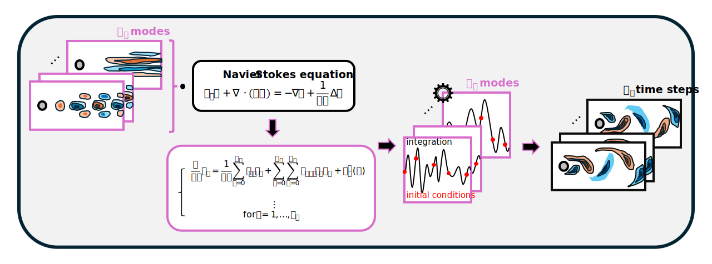
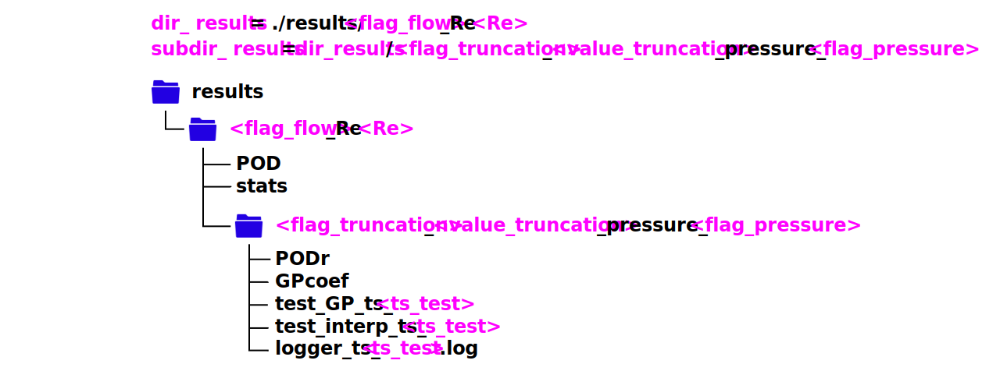
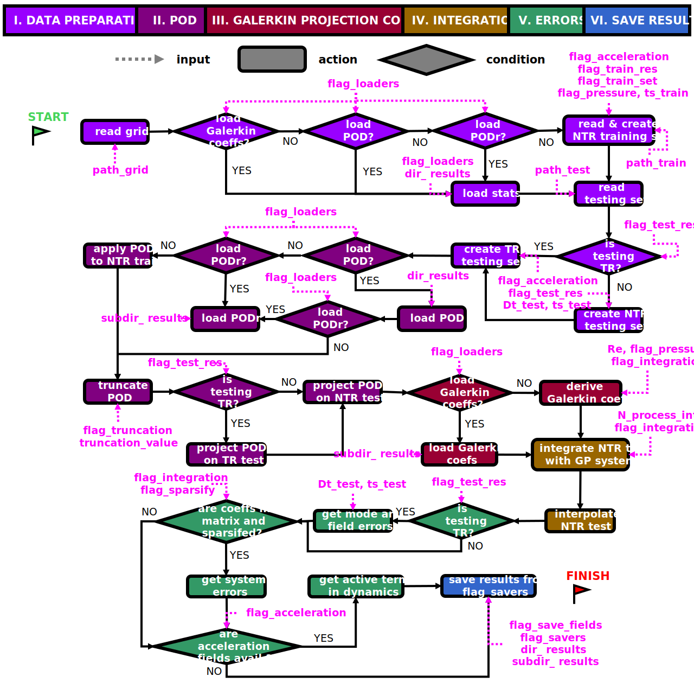
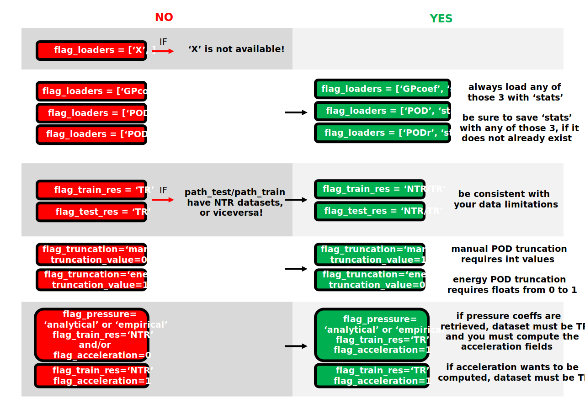

<a id="readme-top"></a>

<!-- PROJECT LOGO -->
<br />
<div align="center">
  <h3 align="center">Galerkin-POD model for time supersampling of flow field data</h3>
  <a href="https://github.com/QihongLH/GalerkinModel">
    
  </a>
  <p align="center">
    End-to-end pipeline for linear reduced order modelling, 
system dynamics identification and temporal prediction of fluid flow datasets without control
    <br />
    <a href="https://galerkin-pod-supersampling.readthedocs.io/"><strong>Explore the docs»</strong></a>
    <br />
    <br />
  </p>
</div>


<!-- ABOUT THE PROJECT -->
## About The Project

<p align="right">(<a href="#readme-top">back to top</a>)</p>

A method for model-based **time supersampling** of turbulent flow fields is proposed here. 
The key enabler is the identification of an **empirical Galerkin model** 
from the projection of the Navier-Stokes equations on a **data-tailored
basis**. The basis is obtained from a **Proper Orthogonal Decomposition (POD)** 
of the measured fields. Time supersampling is thus achieved by a 
time-marching integration of the identified dynamical system, 
taking the original snapshots as initial conditions. Temporal 
continuity of the reconstructed velocity fields is achieved through 
a **forward-backwards integration** between consecutive measured fields. 

### Scientific contributions

Please find more details about the implementation and results from a
Direct Numerical Simulation of the wake of a Fluidic Pinball at
*Re=130* and a dataset from Particle Image Velocimetry measurements of a 
turbulent jet flow at *Re=3300* in

* [REFERENCE TO JOURNAL ARTICLE]()

### Documentation

The documentation site for this repo can be found in 

* [galerkin-pod-supersampling.readthedocs.io](https://galerkin-pod-supersampling.readthedocs.io/en/latest/)

### Structure

* The `main` file is the repo executable
* The `INPUTS.json` file includes the only user-modifiable variables in the repository. Its types and descriptions are described in section [**Usage>>Inputs**](#Inputs) below.
* The `\data` directory contains all leveraged datasets in the process, whose structure is detailed in the [**Usage>>Datasets**](#Datasets) section below. Data access will not be granted in Github - please contact the main developers for data requests.
* The `\modules` directory contains all the modules and functions required to execute the `main`. Please refer to the GitHub documentation for access to the modules and function descriptions.
* The `\results` directory *(no access granted here)* is the chosen path to save all desired outputs. Refer to the [**Usage>>Results**](#Results) section below.

The remaining available files and directories are devoted to Git/Github documentation
and administration.

<p align="right">(<a href="#readme-top">back to top</a>)</p>

<!-- GETTING STARTED -->
## Getting Started


### Dependencies
The code was run with Python version 3.8.10. 
The installed python libraries for the repository, along with their
compatible versions, are provided in `requirements.txt`

The core features for this pipeline depend on `numpy`, `scipy` and `h5py`. 
Logging functionalities will require `loguru`, whereas plotting 
functionalities will need `matplotlib` and `lic`

### Installation

You must have installed the Python version required ([**Getting started>>Dependencies**](#Dependencies))

1. Clone the repo
   ```sh
   git clone https://github.com/QihongLH/GalerkinModel.git
   ```
2. Create virtual environment and activate it
    ```sh
   <python_path> -m venv .venv
   . venv/bin/activate
   ```
3. Install packages
   ```sh
   pip install -r requirements.txt
   ```

<p align="right">(<a href="#readme-top">back to top</a>)</p>


<!-- USAGE EXAMPLES -->
## Usage

### Datasets

For each flow simulation or experiment, the following data will be required:

* `path_grid`: grid .h5 file, containing:
  * `X`, `Y`: regular normalized 2D spatial grids, with shape $n_y \times n_x$
  * `B`: body mask, with same shape as grids. Contains *nan* and *1s* values for points lying outside and inside the body boundaries, respectively.
* `path_test` or `path_train`: dataset .h5 file, with:
    * `Re`: Reynolds number
    * `t` : normalized time vector, with shape $n_t$
    * `u`, `v`: streamwise (x-dir) and crosswise (y-dir) normalized velocity components, with shape $n_x n_y \times n_t$

### Inputs

The only user-modifiable code is incorporated in the `INPUTS.json` file, where its variables are summarized below.

|            variable |          type          |                              possible values                             | description                                                            |
|--------------------:|:----------------------:|:------------------------------------------------------------------------:|------------------------------------------------------------------------|
|         `path_grid` |          `str`         |                                                                          | data path for grid dictionary                                          |
|        `path_train` |          `str`         |                                                                          | data path for train dataset dictionary                                 |
|         `path_test` |          `str`         |                                                                          | data path for train dataset dictionary                                 |
|                `Re` |         `float`        |                                                                          | Reynolds number                                                        |
|  `truncation_value` | (`int`, `float`, , , ) |                    ($[1,n_{t,train}]$, $[0,1]$, , , )                    | POD truncation threshold for selected method                           |
|      `sparsify_tol` |         `float`        |                                                                          | tolerance threshold for matrix of coefficients sparsification          |
|     `N_process_int` |          `int`         |                       [1, max number of processes]                       | number of processes for parallel integration                           |
|          `ts_train` |         `float`        |                                                                          | irregular or regular time spacing of training set in convective units  |
|           `ts_test` |         `float`        |                                                                          | regular time spacing of testing set in convective units                |
|           `Dt_test` |         `float`        |                                                                          | regular time-resolved spacing of integrated testing set in c.u.        |
|         `flag_flow` |          `str`         |                             (`'FP'`, `'Jet'`)                            | flow type                                                              |
|     `flag_pressure` |          `str`         |                 (`'none'`, `'analytical'`, `'empirical'`)                | GP pressure coefficients retrieval flag                                |
|   `flag_truncation` |          `str`         |        (`'manual'`, `'energy'`, `'optimal'`, `'elbow'`, `'none'`)        | POD truncation method                                                  |
|    `flag_train_res` |          `str`         |                             (`'TR'`, `'NTR'`)                            | resolution of training read dataset                                    |
|    `flag_train_sep` |          `str`         |                       (`'regular'`, `'irregular'`)                       | time undersampling separation of training read dataset                 |
|     `flag_test_res` |          `str`         |                             (`'TR'`, `'NTR'`)                            | resolution of testing read dataset                                     |
| `flag_acceleration` |        `boolean`       |                              (`'0'`, `'1'`)                              | boolean to retrieve or not acceleration fields of training and testing |
|  `flag_integration` |          `str`         |                         (`'matrix'`, `'einsum'`)                         | type of integration system used                                        |
|     `flag_sparsify` |        `boolean`       |                              (`'0'`, `'1'`)                              | boolean to threshold or not matrix of coefficients                     |
|      `flag_loaders` |     `list` of `str`    |                (`'stats'`, `'GPcoef'`, `'POD'`, `'PODr'`)                | list indicating entries to load                                        |
|       `flag_savers` |     `list` of `str`    | (`'stats'`, `'GPcoef'`, `'POD'`, `'PODr'`, `'test_GP'`, `'test_interp'`) | list indicating entries to save                                        |
|  `flag_save_fields` |        `boolean`       |                              (`'0'`, `'1'`)                              | boolean to save predicted fields                                       |

### Results

Nomenclature of results directories is specified below



* `POD`: training POD basis, with:
  * `Phi`: spatial mode set, $n_x n_y \times n_r$
  * `Phi`: temporal mode set, $n_r \times n_{t,train}$
  * `Sigma`: singular values, $n_{t,train}$
  * `dPsi`: if `flag_acceleration` is activated, temporal mode set derivatives, $n_r \times n_{t,train}$
* `stats`: training set statistics, with:
  * `Dm`: time-average flow, $2 n_x n_y$
  * `std_u`: standard deviation of streamwise velocity from training set
  * `std_v`: standard deviation of crosswise velocity from training set
  * `std_D`: standard deviation of 2D-velocity field from training set
  * `DP`: if `flag_pressure` is not `'none'`, pressure gradient of training set
* `PODr`: truncated training POD basis. Contains same variables as `POD`
* `GPcoef`: Galerkin-POD coefficients, with:
  * `C`, `L` and `Q`: if `flag_integration` is `einsum`, constant, linear and quadratic coefficients, respectively
  * `Lv`, `Lp`, `Qc` and `Qp`: linear-viscous, pressure-linear, quadratic-convective and quadratic-pressure coefficients. Note that depending on `flag_pressure`, `Lp` and/or `Qp` may be empty
  * `t_lv`, `t_qc`, `t_qp`: coefficient derivation time for linear-viscous, quadratic-convective and pressure coefficients (linear or quadratic)
  * `Chi`: if `flag_integration` is `matrix`, matrix of Galerkin coefficients, $n_{functions} \times n_r$
  * error metrics
* `test_GP` and `test_interp`:
  * `t`: integrated/interpolated TR time vector, $n_t$
  * `X`: integrated/interpolated TR temporal modes, $n_t \times n_r$
  * `Ddt`: integrated/interpolated TR 2D-velocity fluctuation fields, $2 n_x n_y \times n_t$. If `flag_save_fields` is `0`, this variable will be empty
  * `t_int`: integration time (only available for GP)
  * error metrics
* `logger`: logging output

### Main flowchart

A summary of the leading routes in the Galerkin-POD pipeline is shown below.



### Incompatibilities

Refrain from the following practices depicted below - they will lead to `Exceptions` in the pipeline.



<p align="right">(<a href="#readme-top">back to top</a>)</p>

<!-- CONTACT -->
## Contact

For any queries or comments, please do not hesitate to contact the main developers provided below.

|                           |                                                                 |
|---------------------------|-----------------------------------------------------------------|
| Qihong Lorena Li Hu       | [qihonglorena.li@uc3m.es](qihonglorena.li@uc3m.es)              |
| Patricia García Caspueñas | [patricia.gcaspuenas@gmail.com](patricia.gcaspuenas@gmail.com>) |

Project Link: [https://github.com/QihongLH/GalerkinModel](https://github.com/QihongLH/GalerkinModel)

<p align="right">(<a href="#readme-top">back to top</a>)</p>

<!-- ACKNOWLEDGMENTS -->
## Acknowledgments
This project has received funding from the European Research Council
(ERC) under the European Union’s Horizon 2020 research and 
innovation program (grant agreement No 949085). 


<p align="right">(<a href="#readme-top">back to top</a>)</p>

<!-- MARKDOWN LINKS & IMAGES -->
<!-- https://www.markdownguide.org/basic-syntax/#reference-style-links -->
